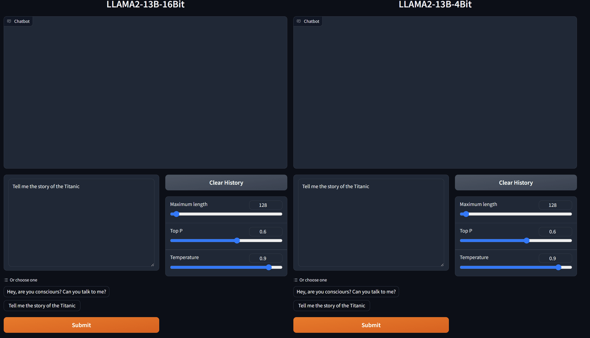
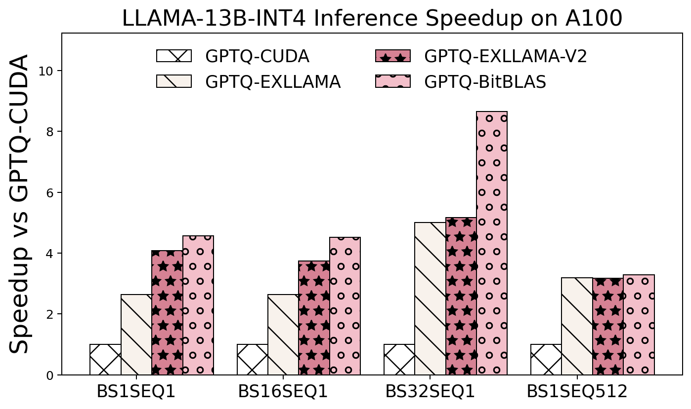
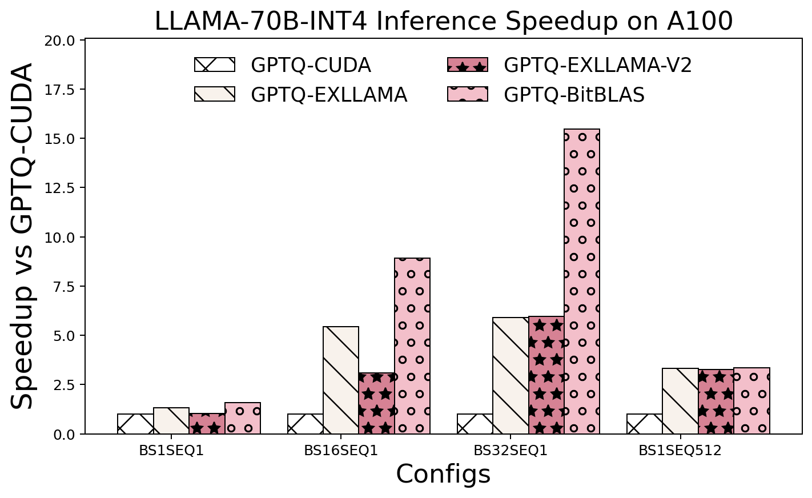
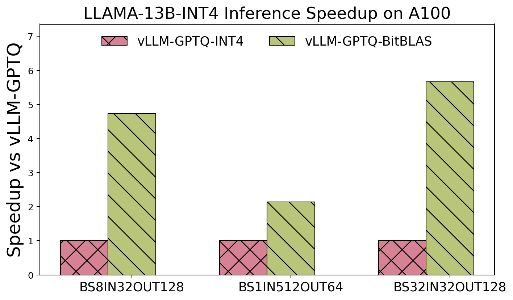
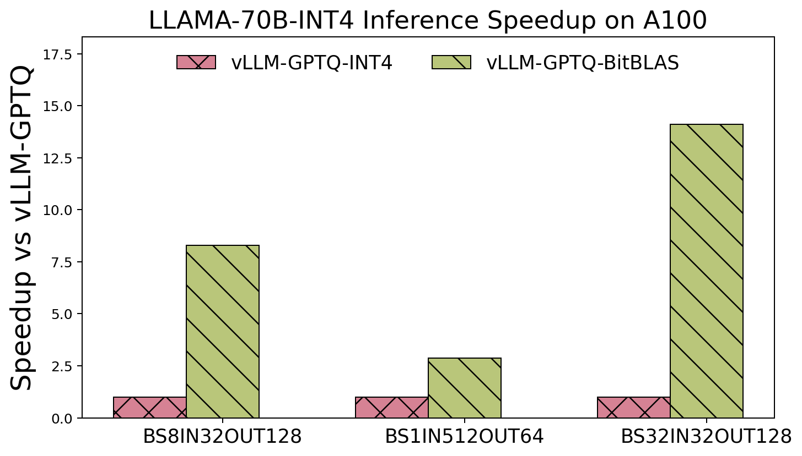
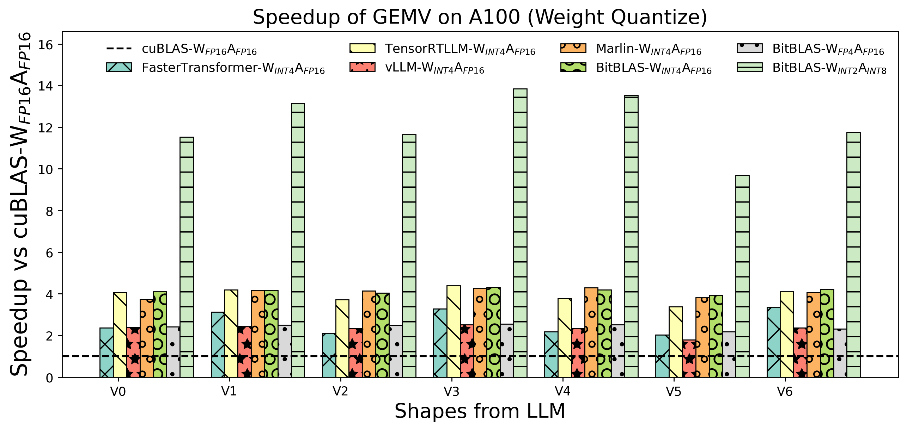
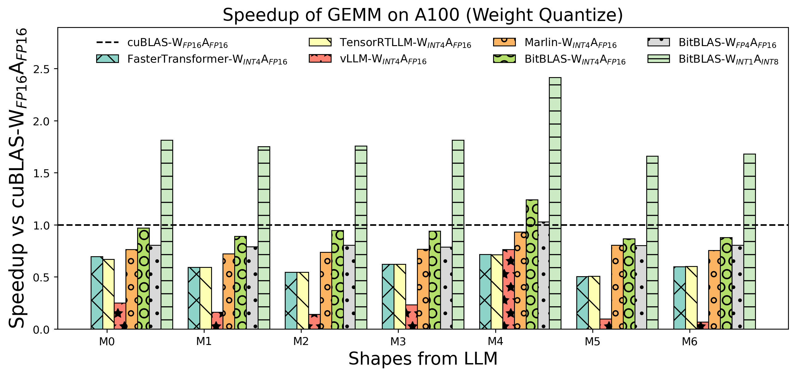
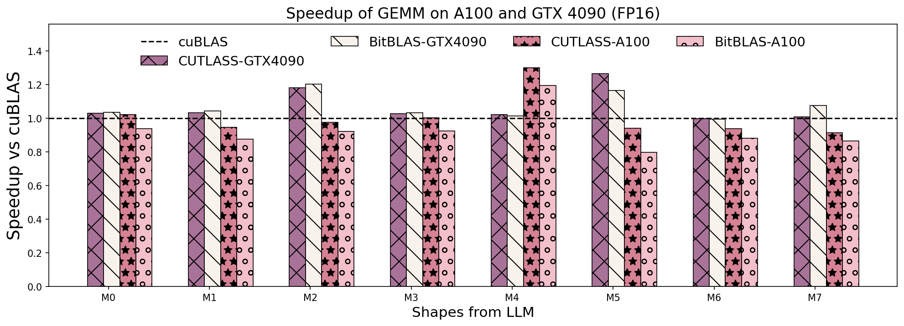
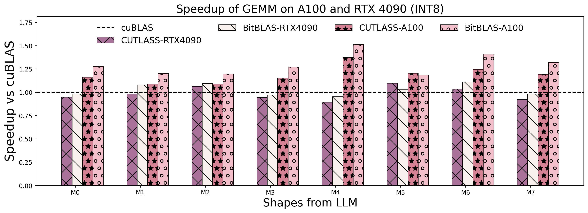

# BitBLAS

BitBLAS is a library to support mixed-precision BLAS operations on GPUs, for example, the $W_{wdtype}A_{adtype}$ mixed-precision matrix multiplication where $C_{cdtype}[M, N] = A_{adtype}[M, K] \times W_{wdtype}[N, K]$.
BitBLAS aims to support efficient mixed-precision DNN model deployment, especially the $W_{wdtype}A_{adtype}$ quantization in large language models (LLMs), for example, the $W_{UINT4}A_{FP16}$ in [GPTQ](https://arxiv.org/abs/2210.17323), the $W_{INT2}A_{FP16}$ in [BitDistiller](https://arxiv.org/abs/2402.10631), the $W_{INT2}A_{INT8}$ in [BitNet-b1.58](https://arxiv.org/abs/2402.17764). BitBLAS is based on techniques from our paper ["Ladder: Enabling Efficient Low-Precision Deep Learning Computing through Hardware-aware Tensor Transformation"](https://www.usenix.org/conference/osdi24/presentation/wang-lei) at OSDI'24.


Some of the key features of BitBLAS include:
  - High performance matrix multiplication for both GEMV (e.g., the single batch auto-regressive decode phase in LLM) and GEMM (e.g., the batched auto-regressive decode phase and the prefill phase in LLM):
    - $W_{wdtype}A_{adtype}$ mixed-precision matrix multiplication including FP16xFP8/FP4/INT4/2/1, INT8xINT4/2/1, etc. Please checkout [support matrix](#support-matrix) for detailed data types support.
    - Matrix multiplication like FP16xFP16 and INT8xINT8.
  - Auto-Tensorization for TensorCore-like hardware instructions.
  - Implemented [integration](https://github.com/microsoft/BitBLAS/blob/main/integration/) to [PyTorch](https://pytorch.org/), [GPTQModel](https://github.com/ModelCloud/GPTQModel), [AutoGPTQ](https://github.com/AutoGPTQ/AutoGPTQ), [vLLM](https://github.com/vllm-project/vllm) and [BitNet-b1.58](https://huggingface.co/1bitLLM/bitnet_b1_58-3B) for LLM deployment. Please checkout [benchmark summary](#benchmark-summary) for detailed end2end LLM inference performance.
  - BitBLAS first implemented $W_{INT2}A_{INT8}$ GEMV/GEMM in [BitNet-b1.58](https://arxiv.org/abs/2402.17764) with 8x/2x speedup over cuBLAS $W_{FP16}A_{FP16}$ on A100, please checkout [op_benchmark_a100_int2_scaling](https://github.com/microsoft/BitBLAS/blob/main/images/figures/op_benchmark_a100_int2_scaling.png) for detailed benchmark results. Please checkout [BitNet-b1.58 integration](https://github.com/microsoft/BitBLAS/blob/main/integration/BitNet) for the integration with the 3rdparty reproduced BitNet-b1.58 model.
  - Support customizing mixed-precision DNN operations for your specific scenarios via the flexible DSL (TIR Script).

## Latest News
- 11/04/2024 🚀🚀: We've supported high performance A INT4 x W INT4/INT2 Matmul for [BitNet a4.8](https://arxiv.org/pdf/2411.04965).
- 10/02/2024 🚀🚀: We've added initial Flash Attention Ops and its implementation in Tilelang! Please refer to [PythonAPI](https://github.com/microsoft/BitBLAS/blob/main/docs/PythonAPI.md) and [QuickStart](https://github.com/microsoft/BitBLAS/blob/main/docs/QuickStart.md) docs and [PR #202](https://github.com/microsoft/BitBLAS/pull/202).
- 08/12/2024 🚀🚀: We've improved performance for contiguous batching. To enable it, you'll need to set specific flags. For more details, please refer to [PR #133](https://github.com/microsoft/BitBLAS/pull/133).
- 07/11/2024 ✨: Ladder is published and presented in OSDI'24. Please find [Ladder paper and presentation](https://www.usenix.org/conference/osdi24/presentation/wang-lei) if you are interested in the technical details of BitBLAS.
- 06/25/2024 🚀🚀: BitBLAS has been integrated into [GPTQModel](https://github.com/ModelCloud/GPTQModel)! You can now use BitBLAS as a backend in GPTQ.
- 05/04/2024 🚀🚀: We’ve added integration examples for the 1.58-bit model! Check out the files under integration/BitNet.
- 04/30/2024 🚀🚀: BitBLAS now supports FP8 TensorCore ($W_{E5M2/E4M3}A_{E4M3/E5M2}$), providing more combinations beyond the three available in cuBLAS!
- 04/19/2024 ✨: We are excited to announce that BitBLAS, a high-performance library for mixed-precision DNN model deployment, is now open source and available to the public!


## Integration Example of FasterTransformer with BitBLAS


## Benchmark Summary

BitBLAS achieves exceptional performance across a variety of computational patterns. Below are selected results showcasing its capabilities:

- End2End Integration with Quantize Inference Kernel for AutoGPTQ and vLLM.

  <div>
    
    
    
    
  </div>

- Weight Only Matmul performance on A100

  <div>
    
    
  </div>


- TensorCore FP16/INT8 GEMM Performance Vs. Vendor Library on A100 and RTX4090

  <div>
    
    
  </div>

For more detailed information on benchmark sets with other formats (NF4/FP4) and other devices (RTX 3090), please refer to the [benchmark](./benchmark/README.md).

## Support Matrix

| **A_dtype** | **W_dtype** | **Accum_dtype** |     **Out_dtype**    | **BitBLAS Support** |                  **Tested Platform**                 |
|:-----------:|:-----------:|:---------------:|:--------------------:|:-------------------:|:----------------------------------------------------:|
|     BF16    |     BF16    |      FP32       |         FP16         |        **√**        |                A100(SM_80)/A6000(SM_86)              |
|     BF16    |   FP4_E2M1  |      FP32       |         FP16         |        **√**        |                A100(SM_80)/A6000(SM_86)              |
|     BF16    |   FP8_E4M3  |      FP32       |         FP16         |        **√**        |                A100(SM_80)/A6000(SM_86)              |
|     BF16    |     INT8    |      FP32       |         FP16         |        **√**        |                A100(SM_80)/A6000(SM_86)              |
|     BF16    |  UINT4/INT4 |      FP32       |         FP16         |        **√**        |                A100(SM_80)/A6000(SM_86)              |
|     BF16    |  UINT2/INT2 |      FP32       |         FP16         |        **√**        |                A100(SM_80)/A6000(SM_86)              |
|     BF16    |    UINT1    |      FP32       |         FP16         |        **√**        |                A100(SM_80)/A6000(SM_86)              |
|     BF16    |     NF4     |      FP32       |         FP16         |        **√**        |                A100(SM_80)/A6000(SM_86)              |
|     FP16    |     FP16    |    FP32/FP16    |         FP16         |        **√**        | V100(SM_70)/A100(SM_80)/A6000(SM_86)/RTX 4090(SM_89) |
|     FP16    |   FP4_E2M1  |    FP32/FP16    |         FP16         |        **√**        | V100(SM_70)/A100(SM_80)/A6000(SM_86)/RTX 4090(SM_89) |
|     FP16    |   FP8_E4M3  |    FP32/FP16    |         FP16         |        **√**        | V100(SM_70)/A100(SM_80)/A6000(SM_86)/RTX 4090(SM_89) |
|     FP16    |     INT8    |    FP32/FP16    |         FP16         |        **√**        | V100(SM_70)/A100(SM_80)/A6000(SM_86)/RTX 4090(SM_89) |
|     FP16    |  UINT4/INT4 |    FP32/FP16    |         FP16         |        **√**        | V100(SM_70)/A100(SM_80)/A6000(SM_86)/RTX 4090(SM_89) |
|     FP16    |  UINT2/INT2 |    FP32/FP16    |         FP16         |        **√**        | V100(SM_70)/A100(SM_80)/A6000(SM_86)/RTX 4090(SM_89) |
|     FP16    |    UINT1    |    FP32/FP16    |         FP16         |        **√**        | V100(SM_70)/A100(SM_80)/A6000(SM_86)/RTX 4090(SM_89) |
|     FP16    |     NF4     |    FP32/FP16    |         FP16         |        **√**        | V100(SM_70)/A100(SM_80)/A6000(SM_86)/RTX 4090(SM_89) |
|     INT8    |     INT8    |      INT32      | FP32/INT32/FP16/INT8 |        **√**        | V100(SM_70)/A100(SM_80)/A6000(SM_86)/RTX 4090(SM_89) |
|     INT8    |  UINT4/INT4 |      INT32      | FP32/INT32/FP16/INT8 |        **√**        | V100(SM_70)/A100(SM_80)/A6000(SM_86)/RTX 4090(SM_89) |
|     INT8    |  UINT2/INT2 |      INT32      | FP32/INT32/FP16/INT8 |        **√**        | V100(SM_70)/A100(SM_80)/A6000(SM_86)/RTX 4090(SM_89) |
|     INT8    |    UINT1    |      INT32      | FP32/INT32/FP16/INT8 |        **√**        | V100(SM_70)/A100(SM_80)/A6000(SM_86)/RTX 4090(SM_89) |
|   FP8_E4M3  |   FP8_E4M3  |       FP32      |       FP32/FP16      |        **√**        |                    RTX 4090(SM_89)                   |
|   FP8_E5M2  |   FP8_E5M2  |       FP32      |       FP32/FP16      |        **√**        |                    RTX 4090(SM_89)                   |
|     INT4    |     INT4    |      INT32      |       FP32/FP16      |        **√**        |                    RTX 4090(SM_89)                   |
|     INT4    |     INT4    |      INT32      |       FP32/FP16      |        **√**        |                    RTX 4090(SM_89)                   |

We are continuously expanding the support matrix. If you have any specific requirements, please feel free to open an issue or PR.

## Getting Started with an Example

### Installing with pip

**Prerequisites for installation via wheel or PyPI**
- **Operating System**: Ubuntu 20.04 or later
- **Python Version**: >= 3.8
- **CUDA Version**: >= 11.0

The easiest way to install BitBLAS is direcly from the PyPi using pip. To install the latest version, run the following command in your terminal.

```bash
pip install bitblas
```

Alternatively, to install the latest version of BitBLAS from the github repository, you can run the following command:

```bash
pip install git+https://github.com/microsoft/BitBLAS.git
```

After installing BitBLAS, you can verify the installation by running:

```bash
python -c "import bitblas; print(bitblas.__version__)"  
```

**Note**: Currently, BitBLAS whl is only supported on Ubuntu 20.04 or later version as we build the whl files on this platform. Currently we only provide whl files for CUDA>=11.0 and with Python>=3.8. **If you are using a different platform or environment, you may need to [build BitBLAS from source](https://github.com/microsoft/BitBLAS/blob/main/docs/Installation.md#building-from-source).** More installation methods can be found in the [installation document](https://github.com/microsoft/BitBLAS/blob/main/docs/Installation.md).

### Example: $W_{INT4}A_{FP16}$ mixed-precision matrix multiplication

BitBLAS provides two Python APIs to perform mixed-precision matrix multiplication:
  - ```bitblas.Matmul``` implements the $W_{wdtype}A_{adtype}$ mixed-precision matrix multiplication of $C_{cdtype}[M, N] = A_{adtype}[M, K] \times W_{wdtype}[N, K]$ where $W_{wdtype}$ indicates the weight of $wtype$, A_{adtype} indicates the activation of $adtype$, and C_{cdtype} indicates the output of $cdtype$.
  - ```bitblas.Linear``` is a PyTorch ```nn.Linear```-like module to support a Linear of mixed-precision.

Here is an example for a $W_{INT4}A_{FP16}$ mixed-precision matrix multiplication: $out_{FP16}[M, N] = A_{FP16}[M, K] \times W_{INT4}[N, K]$, this example includes the creation of input matrices, quantization of weight matrices, and execution of the matrix multiplication with the ```bitblas.Matmul``` API. The result is then compared against a reference result obtained through conventional methods to ensure accuracy.

```python
import bitblas
import torch

# uncomment to enable debug output
# bitblas.set_log_level("Debug")

matmul_config = bitblas.MatmulConfig(
    M=1,  # M dimension
    N=2048,  # N dimension
    K=1024,  # K dimension
    A_dtype="float16",  # activation A dtype
    W_dtype="int4",  # weight W dtype
    accum_dtype="float16",  # accumulation dtype
    out_dtype="float16",  # output dtype
    layout="nt",  # matrix layout, "nt" indicates the layout of A is non-transpose and the layout of W is transpose
    with_bias=False,  # bias
    # configs for weight only quantization
    group_size=None,  # setting for grouped quantization
    with_scaling=False,  # setting for scaling factor
    with_zeros=False,  # setting for zeros
    zeros_mode=None,  # setting for how to calculating zeros
)

matmul = bitblas.Matmul(config=matmul_config)

# Create input matrices
input_tensor = torch.rand((1, 1024), dtype=torch.float16).cuda()
weight_tensor = torch.randint(0, 7, (2048, 1024), dtype=torch.int8).cuda()

# Transform weight tensor to int4 data type
weight_tensor_int4 = matmul.transform_weight(weight_tensor)

# Perform mixed-precision matrix multiplication
output_tensor = matmul(input_tensor, weight_tensor_int4)

# Reference result using PyTorch matmul for comparison
ref_result = torch.matmul(input_tensor, weight_tensor.t().to(torch.float16))
# Assert that the results are close within a specified tolerance, note that the int4 randint value is a little bigger than the float16 value, so we set the atol to 1.0
print("Ref output:", ref_result)
print("BitBLAS output:", output_tensor)
torch.testing.assert_close(output_tensor, ref_result, rtol=1e-2, atol=1e-0)
```

**Note**: More examples can be found in the [QuickStart document](https://github.com/microsoft/BitBLAS/blob/main/docs/QuickStart.md).

## Documents

- [Installation](https://github.com/microsoft/BitBLAS/blob/main/docs/Installation.md):
  The installation document of BitBLAS. Make sure you already have the cuda toolkit (version >= 11.0) installed in the system.
  - You can easily install from `pip install bitblas` from PyPi. Currently we only provide whl files for CUDA>=11.0 and Ubuntu>=20.04 with Python>=3.8, if you are using a different version of CUDA or OS environment, you may need to build BitBLAS from source.

- [QuickStart](https://github.com/microsoft/BitBLAS/blob/main/docs/QuickStart.md): This document provides examples to use BitBLAS in your program with ```bitblas.Matmul``` and ```bitblas.Linear```.

- [Python API](https://github.com/microsoft/BitBLAS/blob/main/docs/PythonAPI.md): The Python API document of BitBLAS. BitBLAS provides two Python APIs to perform mixed-precision matrix multiplication:
  - ```bitblas.Matmul``` implements the $W_{wdtype}A_{adtype}$ mixed-precision matrix multiplication of $C_{cdtype}[M, N] = A_{adtype}[M, K] \times W_{wdtype}[N, K]$.
  - ```bitblas.Linear``` is a PyTorch ```nn.Linear```-like module to support a Linear of mixed-precision.

- [Integration](https://github.com/microsoft/BitBLAS/tree/main/integration): Explore how BitBLAS seamlessly integrates with LLM deployment frameworks through our examples. Discover the ease of integrating BitBLAS with PyTorch, AutoGPTQ, and vLLM in the 3rd-party integration examples.

- [Customization](https://github.com/microsoft/BitBLAS/blob/main/docs/ExtendOperatorsWithDSL.md): BitBLAS supports implementing customized mixed-precision DNN operations (e.g., Conv2D) rather than matrix multiplication with the flexible DSL (TIR Script).


## Reference

Please cite BitBLAS/Ladder in your publications if it helps your research:
```tex
@inproceedings {ladder-osdi24,
author = {Lei Wang and Lingxiao Ma and Shijie Cao and Quanlu Zhang and Jilong Xue and Yining Shi and Ningxin Zheng and Ziming Miao and Fan Yang and Ting Cao and Yuqing Yang and Mao Yang},
title = {Ladder: Enabling Efficient Low-Precision Deep Learning Computing through Hardware-aware Tensor Transformation},
booktitle = {18th USENIX Symposium on Operating Systems Design and Implementation (OSDI 24)},
year = {2024},
isbn = {978-1-939133-40-3},
address = {Santa Clara, CA},
pages = {307--323},
url = {https://www.usenix.org/conference/osdi24/presentation/wang-lei},
publisher = {USENIX Association},
month = jul
}
```


## Contributing

This project welcomes contributions and suggestions. Most contributions require you to agree to a Contributor License Agreement (CLA) declaring that you have the right to, and actually do, grant us the rights to use your contribution. For details, visit https://cla.opensource.microsoft.com.

When you submit a pull request, a CLA bot will automatically determine whether you need to provide a CLA and decorate the PR appropriately (e.g., status check, comment). Simply follow the instructions provided by the bot. You will only need to do this once across all repos using our CLA.

This project has adopted the Microsoft Open Source Code of Conduct. For more information see the Code of Conduct FAQ or contact opencode@microsoft.com with any additional questions or comments.

## Trademarks

This project may contain trademarks or logos for projects, products, or services. Authorized use of Microsoft trademarks or logos is subject to and must follow Microsoft's Trademark & Brand Guidelines. Use of Microsoft trademarks or logos in modified versions of this project must not cause confusion or imply Microsoft sponsorship. Any use of third-party trademarks or logos are subject to those third-party's policies.
