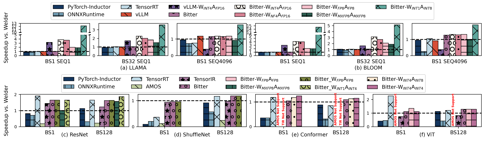

# Reproduce the results of Figure 10

The Figure 10 is about the end-to-end performance of the selected baselines and the proposed method. The end-to-end performance is measured by the inference time of the model. The inference time is measured in seconds.

Run the following command to generate the results of Figure 10:

```bash
python3 run_all.py
```

The `run_all.py` script has the following options:

- `--reproduce`: bool, whether to reproduce the results, otherwise it will use our logges paper result, default value is `False`.
- `--force_tune`: bool, whether to force tune the op with AMOS/TensorIR, otherwise use the checkpoints if available, default value is `False`.

The result will be saved in the `pdf` and `png` directory, respectively. For example, the reproduced result is:


