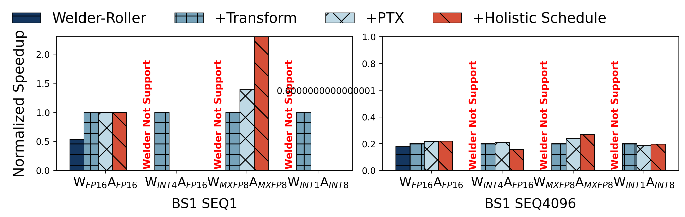

# Reproduce the results of Figure 13

Figure 13 illustrates the normalized speedup of various optimization techniques applied to two batch size sequences, BS1 SEQ1 and BS1 SEQ4096. It compares the performance of Welder-Roller, Transform, PTX, and Holistic Schedule optimizations against different computational precision configurations.

Run the following command to generate the results of Figure 13:

```bash
python3 run_all.py
```

The `run_all.py` script has the following options:

- `--reproduce`: bool, whether to reproduce the results, otherwise it will use our logges paper result, default value is `False`.
- `--force_tune`: bool, whether to force tune the op with AMOS/TensorIR, otherwise use the checkpoints if available, default value is `False`.

The result will be saved in the `pdf` and `png` directory, respectively. For example, the reproduced result is:


