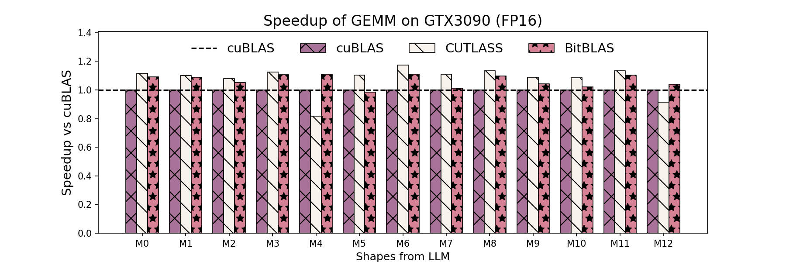
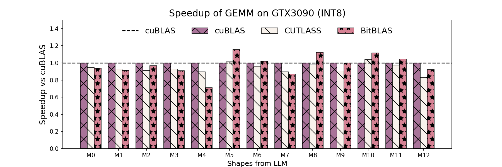
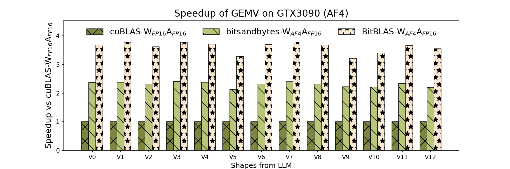
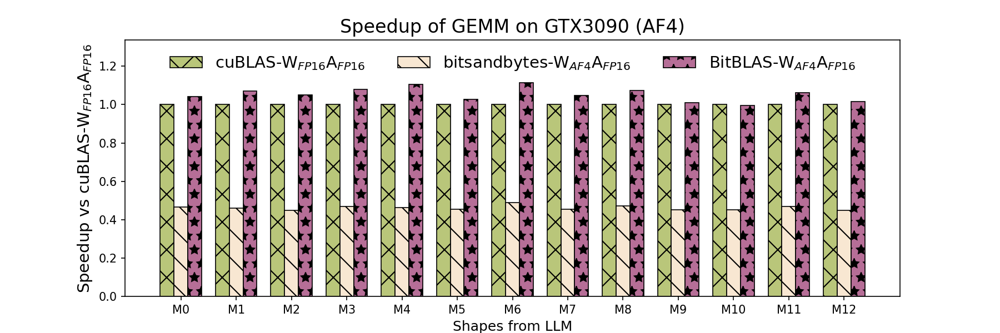
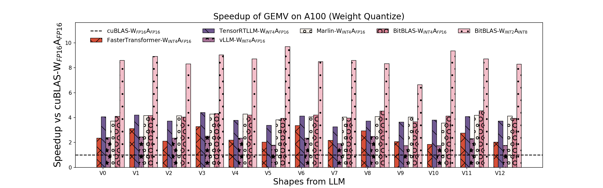
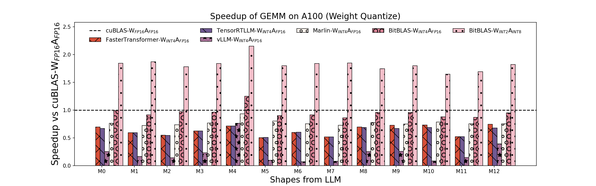

# Speedup Benchmark vs Vendor Libraries

This part presents a benchmark comparison between our custom library, BitBLAS, and various vendor libraries (cuBLAS, CUTLASS, bitsandbytes, faster-transformer, tensorrt-llm, vLLM, and Marlin) across different matrix operation types (GEMM, GEMV) and data formats (float16xfloat16, int8xint8, float16xint4/nf4). The benchmarks are conducted on NVIDIA GPUs - 24GB GTX 3090 and 80GB A100, with CUDA 12.1 installed.

## Benchmark Overview

### Tested Operations and Formats

- GEMM (General Matrix Multiply) and GEMV (General Matrix-Vector Multiply)
- Data formats: float16, int8, float16xint4/nf4

### Hardware

- NVIDIA GTX 3090 (24GB)
- NVIDIA A100 (80GB)

### Software

- CUDA 12.1
- Compared libraries: cuBLAS, CUTLASS, bitsandbytes, faster-transformer, tensorrt-llm, vLLM, Marlin

## Results Summary

### GTX 3090 Benchmarks

- **Float16 and Int8 GEMM with Tensorcore**: BitBLAS matches the performance of cuBLAS and CUTLASS.
- **Float16xnf4 GEMV and GEMM**: BitBLAS achieves 2x the speed of bitsandbytes and 4x the base float16 performance.
- **Optimal performance** in float16xint4 GEMM.

### A100 Benchmarks

- **Int4 Dequantize Performance**: BitBLAS outperforms bitsandbytes, faster-transformer, tensorrt-llm, vLLM, and Marlin.

## Benchmark Configuration

The benchmark configurations for each test scenario are detailed below:

|config|Provider|M|N|K|
|:---:|:---:|:---:|:---:|:---:|
|V0|None|1|16384|16384|
|V1|BLOOM|1|43008|14336|
|V2|BLOOM|1|14336|14336|
|V3|BLOOM|1|57344|14336|
|V4|BLOOM|1|14336|57344|
|V5|OPT|1|9216|9216|
|V6|OPT|1|36864|9216|
|V7|OPT|1|9216|36864|
|V8|LLAMA|1|22016|8192|
|V9|LLAMA|1|8192|22016|
|V10|LLAMA-2|1|8192|8192|
|V11|LLAMA-2|1|28672|8192|
|V12|LLAMA-2|1|8192|28672|
|M0|None|16384|16384|16384|
|M1|BLOOM|8192|43008|14336|
|M2|BLOOM|8192|14336|14336|
|M3|BLOOM|8192|57344|14336|
|M4|BLOOM|8192|14336|57344|
|M5|OPT|8192|9216|9216|
|M6|OPT|8192|36864|9216|
|M7|OPT|8192|9216|36864|
|M8|LLAMA|8192|22016|8192|
|M9|LLAMA|8192|8192|22016|
|M10|LLAMA-2|8192|8192|8192|
|M11|LLAMA-2|8192|28672|8192|
|M12|LLAMA-2|8192|8192|28672|

**Note:** To reproduce the 3rdparty frameworks' benchmark results, please refer to [mlc-benchmark](https://github.com/LeiWang1999/mlc-benchmark).

## Benchmark Images

- GTX 3090
  - 
  - 
  - 
  - 

- A100
  - 
  - 

